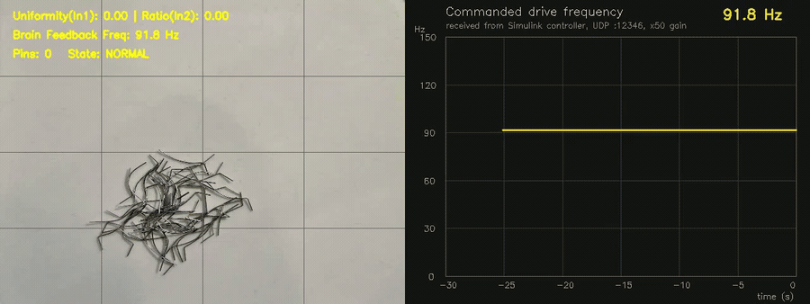
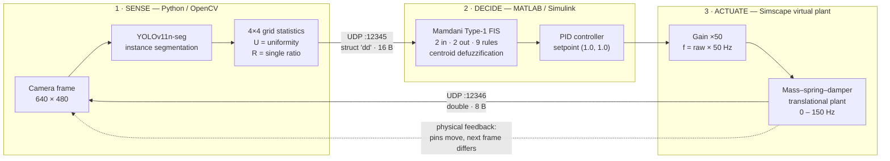

# Intelligent Closed-Loop Vibration Dispersal System for Micro-Probes

**A vision-in-the-loop controller that decides *how hard to shake* a vibratory feeder, from what the camera sees.**
YOLOv11 instance segmentation measures how well 38–89 µm semiconductor probe pins are dispersed; a Mamdani fuzzy inference system cascaded with a PID controller in MATLAB/Simulink turns that measurement into a 0–150 Hz drive frequency, closed over a bidirectional UDP link at sub-millisecond latency.

<p align="center">
  
</p>

<p align="center">
  <em>Left: live segmentation with the 4×4 uniformity grid and the two feature values sent to the controller.
  Right: the drive frequency commanded by the Simulink fuzzy-PID controller — plotted from the values received back over UDP — falling from ≈92 Hz (pile, no resolvable pins) to ≈58 Hz once the pins are dispersed.
  Software-in-the-loop: the input is a cross-fade between two real photographs, not a physical plate.</em>
</p>

> **Status — read this first.** This is a **software-in-the-loop (SITL)** system. The plant is a Simscape mass–spring–damper model in Simulink; **no physical vibratory feeder has been driven yet.** Every number below comes from simulation and from evaluation on a held-out image set. Hardware integration is the next step, not a completed one.

**Author:** Ting Lung (龍霆) — sole author. Department of Bio-Industrial Mechatronics Engineering, National Chung Hsing University (NCHU), Taiwan.
**Advisor:** Prof. Zhi-Xuan Dai (戴芝軒).
**Funding:** NCHU Office of Research and Development, Undergraduate Research Grant, project no. **11528551H** (awarded after competitive internal review).

---

## Table of contents

- [Problem](#problem)
- [Approach](#approach)
- [System architecture](#system-architecture)
- [Results](#results)
- [Tech stack](#tech-stack)
- [Repository layout](#repository-layout)
- [How to run](#how-to-run)
- [What I wrote myself](#what-i-wrote-myself)
- [Limitations and next steps](#limitations-and-next-steps)
- [Dataset and licence](#dataset-and-licence)

---

## Problem

Semiconductor probe cards are populated with hundreds of probe pins per card. As pitch shrinks, the pins shrink with it: the pins in this study are **1.5–3.5 mil in diameter (≈38–89 µm)** — roughly the thickness of a human hair — and are finished with a **nanoscale anti-stick coating** that must not be scratched, because a damaged coating changes contact resistance.

Handling them is the bottleneck:

| Current practice | Failure mode |
| --- | --- |
| Manual pick-up with tweezers | Tweezer jaws scratch the anti-stick coating; slow and operator-dependent |
| Vibratory bowl feeder at a **fixed** frequency | Too low → pins stay piled up and **entangle**, hooking into each other; too high → pins bounce and are **damaged** on impact |

The fixed-frequency feeder is the core issue. A pile of tangled pins and a well-spread monolayer need opposite drive commands, but an open-loop feeder has no way to tell them apart — it applies the same excitation to both. What is missing is not more vibration power; it is **feedback about the current dispersal state**.

This project closes that loop.

---

## Approach

The control philosophy is one sentence:

> **The worse the dispersal state, the higher the impact frequency. The more uniform the state, the lower the maintenance frequency.**

To make "dispersal state" a number the controller can act on, each frame is reduced to **two normalised features**:

**1. Uniformity `U ∈ [0, 1]`** — how evenly the pins are spread over the tray.
The frame is divided into a **4×4 virtual grid**. Every detected single pin contributes its mask centroid to one cell. The standard deviation `σ` of the 16 cell counts is then mapped to a score:

```
U = clip( 1 − σ / σ_max , 0, 1 )        with σ_max = 6.0
```

All pins in one corner → large `σ` → `U → 0`. Pins evenly spread → small `σ` → `U → 1`.

**2. Single ratio `R ∈ [0, 1]`** — what fraction of the pins are currently separated rather than clumped.
`R` is the current count of confidently segmented **single** pins normalised by a slowly decaying running maximum, so the metric adapts to how many pins are actually in the tray instead of assuming a fixed batch size:

```
if count > peak:  peak ← count
else:             peak ← max( peak × (1 − 0.005), count, 5.0 )
R = clip( count / peak, 0, 1 )
```

A dedicated guard handles the hardest case: when the pins were being tracked and the count **collapses to zero**, that is not an empty tray — it is a pile so entangled that the segmenter can no longer resolve individual pins. The system forces `U = 0, R = 0` and flags a clog alert, which drives the controller straight to maximum impact.

`(U, R)` is what crosses the UDP link. Everything downstream reasons only about these two numbers.

---

## System architecture

Three layers, sense → decide → actuate, closed by the fact that the actuator changes what the camera sees on the next frame.



### 1 · Sense — YOLOv11 instance segmentation

`yolo11n-seg.pt` fine-tuned for 100 epochs at 640×640 on a single class (`probe`). Instance segmentation rather than bounding boxes is deliberate: these pins are thin, bent, and lie across each other, so axis-aligned boxes of two crossing pins overlap almost completely, while their masks do not. Inference runs at `conf = 0.15` — a low threshold chosen on purpose, because for this control task a missed pin biases the uniformity estimate more than a spurious one.

### 2 · Decide — Mamdani fuzzy inference cascaded with PID

A Mamdani Type-1 FIS (`control/mamdanitype1.fis`), 2 inputs → 2 outputs, **9 rules**, min/max implication and aggregation, **centroid** defuzzification.

| | Membership functions |
| --- | --- |
| Input `Uniformity` [0, 1] | `Poor` (trap), `Normal` (tri), `Good` (trap) |
| Input `Single_Ratio` [0, 1] | `Few` (trap), `Normal` (tri), `Many` (trap) |
| Output `Vibration_Gain` [0, 2] | `Gentle` (tri), `Impact` (trap) |
| Output `Freq_Gain` [1, 2] | `Gentle` (tri), `Impact` (tri) |

Complete rule base:

| # | If `Uniformity` | and `Single_Ratio` | then `Vibration_Gain` | and `Freq_Gain` |
| --- | --- | --- | --- | --- |
| 1 | Poor | Few | **Impact** | **Impact** |
| 2 | Normal | Few | **Impact** | **Impact** |
| 3 | Good | Few | Gentle | Gentle |
| 4 | Poor | Normal | **Impact** | Gentle |
| 5 | Normal | Normal | Gentle | Gentle |
| 6 | Good | Normal | Gentle | Gentle |
| 7 | Poor | Many | Gentle | Gentle |
| 8 | Normal | Many | Gentle | Gentle |
| 9 | Good | Many | Gentle | Gentle |

Rules 1–2 are the ones that matter: **few resolvable single pins is the signature of entanglement**, and that is the only condition that earns full impact excitation. Once pins are separated (`Many`), the rule base backs off to gentle maintenance regardless of uniformity — you do not keep hammering a tray that is already doing what you want.

The fuzzy output feeds a PID controller with setpoint `(1.0, 1.0)` — the ideal state of perfectly uniform, fully separated pins.

### 3 · Actuate — virtual plant

The controller's raw output is converted to a drive frequency by a fixed software gain:

```
f [Hz] = raw_val × 50.0        clamped to [0, 150] Hz
```

That frequency drives a **virtual mechanical plant** built in Simscape — an ideal force source acting on a variable mass restrained by a translational spring and damper, with an ideal translational motion sensor reading the resulting displacement. A mass–spring–damper is the right abstraction for a vibratory plate: it is the same second-order system the physical tray forms, so the model can later be replaced by real hardware without changing the control structure around it.

NaN/Inf rejection and the range clamp sit on the Python side so a transient bad packet cannot command a nonsense frequency.

### Communication — bidirectional UDP

| Direction | Port | Payload | Encoding |
| --- | --- | --- | --- |
| Python → Simulink | **12345** | 16 bytes | `struct.pack('dd', U, R)` |
| Simulink → Python | **12346** | 8 bytes | one IEEE-754 `double` |

Both sockets bind to `127.0.0.1`. The receive socket is **non-blocking** with a 1 ms poll, so the vision loop never stalls waiting on the controller; measured round-trip latency is **< 1 ms**. Loopback UDP was chosen over shared files or the MATLAB Engine API because it is the same transport an industrial controller would use over Ethernet — moving to a real PLC or DAQ later means changing an IP address, not the architecture.

---

## Results

### Perception — YOLOv11n-seg, 100 epochs, 640×640

| Metric | Value |
| --- | --- |
| Box mAP@50 | **82.1 %** |
| Box Recall | **85.1 %** |
| Box Precision | **77.9 %** |
| Mask mAP@50 | **82.1 %** |
| Mask mAP@50-95 | **45.1 %** |

Recall is deliberately higher than precision: for this controller, failing to see a pin corrupts the uniformity statistic, whereas a false positive is diluted across the 4×4 grid. The gap between Mask mAP@50 (82.1 %) and Mask mAP@50-95 (45.1 %) is the honest weak point — the model **finds** the pins reliably but its mask boundaries are loose at high IoU thresholds, which is expected for objects a few pixels wide whose edges blur where they overlap. See [Limitations](#limitations-and-next-steps).

### Closed-loop control — three verification states (SITL)

Each state was driven through the full loop; the controller converged to the frequency shown.

| Probe state | Pins detected | `U` | `R` | PID raw output | **Commanded frequency** | Control action |
| --- | --- | --- | --- | --- | --- | --- |
| Dispersed (target) | 28 | 0.85 | 1.00 | 1.169 | **58.4 Hz** | Low-frequency maintenance |
| Dispersing | ~10 | 0.50 | 0.35 | 1.674 | **83.7 Hz** | Mid-frequency drive |
| Piled / entangled | 0 | 0.00 | 0.00 | 1.837 | **91.8 Hz** | High-frequency impact |

The system behaves as designed: **degrading dispersal state monotonically raises the commanded frequency**, and a fully entangled tray — where the segmenter can no longer resolve a single pin — is correctly driven to maximum impact rather than being mistaken for an empty tray.

---

## Tech stack

| Layer | Tools |
| --- | --- |
| Perception | Python 3.10+, Ultralytics YOLOv11 (`yolo11n-seg`), PyTorch, OpenCV, NumPy |
| Annotation & dataset | Roboflow (YOLOv11 instance-segmentation export) |
| Control | MATLAB / Simulink, Fuzzy Logic Toolbox (Mamdani Type-1 FIS), PID |
| Plant model | Simscape Multibody / Simscape translational mechanics (force source, variable mass, spring, damper, motion sensor) |
| Interprocess link | UDP over loopback, `struct` binary packing, non-blocking sockets |
| Verification | Software-in-the-loop against the Simscape plant model |

---

## Repository layout

```
.
├── vision/
│   ├── probe_detection.py     # main closed-loop node: YOLO inference + features + bidirectional UDP
│   ├── train.py               # fine-tune yolo11n-seg on the probe dataset
│   ├── evaluate.py            # reproduce the metrics table above
│   └── make_demo_clip.py      # blend the two sample frames into a clip for demo recording
├── control/
│   ├── dampedsystem.slx       # Simulink model: UDP I/O, fuzzy + PID, Simscape plant, scopes
│   ├── mamdanitype1.fis       # Mamdani Type-1 FIS, 2 in / 2 out / 9 rules
│   ├── run_controller.m       # load the FIS and open the model
│   ├── add_freq_scope.m       # add the Hz scope on the commanded-frequency signal
│   └── arrange_blocks.m       # auto-arrange the Simulink block diagram
├── models/
│   └── best.pt                # trained YOLOv11n-seg weights (5.7 MB)
├── data/
│   ├── README.md              # dataset card
│   ├── samples/               # two full-resolution probe frames used for SITL playback
│   └── probe-v1-yolov11/      # 46 annotated images, YOLOv11 seg format
├── docs/
│   ├── DEMO_RECORDING.md      # how the demo GIF was produced
│   └── poster_zh.pdf          # conference-format poster (Traditional Chinese)
├── assets/                    # demo GIF and figures used in this README
├── requirements.txt
└── LICENSE                    # MIT
```

---

## How to run

### Prerequisites

- Python 3.10 or newer
- MATLAB R2023a or newer with **Simulink**, **Fuzzy Logic Toolbox**, and whichever toolbox supplies the UDP Send/Receive blocks in your installation (DSP System Toolbox or Instrument Control Toolbox)
- Windows, macOS, or Linux — the UDP link is loopback only, so both processes must run on the same machine

### 1 · Install the Python side

```bash
git clone https://github.com/ttiimm940810/probe-vibration-dispersal.git
cd probe-vibration-dispersal
python -m venv .venv

# Windows
.venv\Scripts\activate
# macOS / Linux
source .venv/bin/activate

pip install -r requirements.txt
```

### 2 · Start the controller first (order matters)

Simulink must be **listening on port 12345 before** Python starts transmitting, otherwise the first packets are dropped.

In MATLAB, from the repository root:

```matlab
cd control
run_controller            % loads mamdanitype1.fis and opens dampedsystem.slx
```

Then in the Simulink window:

1. Confirm the **UDP Receive** block is set to local port **12345**.
2. Confirm the **UDP Send** block is set to `127.0.0.1`, remote port **12346**.
3. Set the stop time to `inf`.
4. Open **Frequency Scope** — the time-domain trace of the commanded frequency in Hz:

   ```matlab
   open_system('dampedsystem/Frequency Scope')
   ```

   The model also contains a `Scope` wired to the Simscape plant's motion sensor and a
   `Spectrum Analyzer`; neither shows the commanded frequency over time.

5. Press **Run**.

### 3 · Start the vision node

In a second terminal:

```bash
python vision/probe_detection.py --source data/samples/probe_dispersed.jpg
```

Useful flags:

```bash
# entangled / piled state
python vision/probe_detection.py --source data/samples/probe_clogged.jpg

# a live camera instead of a still frame
python vision/probe_detection.py --source 0

# record the annotated window to MP4
python vision/probe_detection.py --source data/samples/probe_dispersed.jpg --record assets/vision_capture.mp4

# reproduce the README demo: side-by-side (segmentation | received frequency trace), 100 s
python vision/probe_detection.py --source assets/dispersing.mp4 --record-demo assets/raw/demo_raw.mp4 --record-seconds 100
```

The demo GIF at the top of this page was produced with the last command and trimmed with ffmpeg; see [`docs/DEMO_RECORDING.md`](docs/DEMO_RECORDING.md).

Press **`q`** in the OpenCV window to exit cleanly (both sockets are closed in a `finally` block).

### What you should see

- **Terminal:** a live line reporting pin count, `U`, `R`, and the frequency received back from the controller.
- **OpenCV window:** green mask outlines, the 4×4 grid, and the two feature values with the returned frequency overlaid.
- **Simulink scope:** the commanded frequency settling near 58.4 Hz for the dispersed frame and near 91.8 Hz for the piled frame.

If the overlaid frequency stays at `0.0 Hz`, the return path is not connected — check that the Simulink UDP Send block targets port 12346 and that no other process holds it.

### Reproducing the numbers

```bash
python vision/train.py       # 100 epochs, 640x640, yolo11n-seg
python vision/evaluate.py    # prints the box/mask metrics table
```

---

## What I wrote myself

This was an individual project with no team members. Written by me:

- The entire vision node — feature design (the 4×4 grid uniformity statistic and the decaying-maximum single ratio), the zero-count entanglement guard, the packing/unpacking and non-blocking socket handling.
- The Mamdani FIS: choice of membership function shapes and breakpoints, and all 9 rules.
- The Simulink model: UDP blocks, fuzzy-to-PID cascade, Simscape mass–spring–damper plant, scope instrumentation.
- Dataset collection and annotation (46 images, photographed and labelled by me).
- Training, evaluation, and the SITL verification protocol.

Third-party components: Ultralytics YOLOv11 architecture and `yolo11n-seg` pre-trained weights; MATLAB Fuzzy Logic Toolbox and Simulink block library; OpenCV; Roboflow for annotation export.

---

## Limitations and next steps

Stated plainly, because a reader should know what has and has not been demonstrated.

### Limitations

1. **No hardware in the loop.** The actuator is a Simscape mass–spring–damper model with parameters chosen by hand, not identified from a real plate. No physical vibratory plate, PWM driver, or industrial camera has been connected, and the model's response has not been validated against measurement. Real-world effects — actual resonance, motor response lag, nonlinear friction, lighting drift — are unmodelled.
2. **SITL playback, not live video.** Verification used still frames from the sample set, switched at a rate driven by the commanded frequency to emulate closed-loop response. This validates the control logic and the data path; it does **not** validate that the vibration actually disperses the pins, because the images do not respond to the commands.
3. **Small dataset.** 46 annotated images (32 train / 9 validation / 5 test), including 9 deliberate background frames with no pins. Enough to train a working detector for one tray under one lighting setup; not enough to claim generalisation across trays, backgrounds, or pin geometries.
4. **Loose mask boundaries.** Mask mAP@50-95 of 45.1 % reflects imprecise contours on objects a few pixels wide, worst where pins overlap. Uniformity is computed from mask **centroids**, which is comparatively robust to this, but the single-pin count is not.
5. **Fuzzy parameters tuned by hand.** Membership breakpoints and the ×50 frequency gain were set by engineering judgement and iteration, not by systematic optimisation, and the gain has not been calibrated against any real plate.
6. **Single-machine loopback.** Both processes share one host; no networked or real-time deployment has been tested.

### Next steps

1. **Hardware integration** — industrial camera stream in, Arduino or DAQ PWM out to eccentric vibration motors or a piezo plate, replacing the Simscape plant and closing the loop physically.
2. **Plant identification** — measure the real vibratory plate's frequency response, fit the mass, spring and damper parameters to it, and recalibrate the ×50 gain against measured dispersal efficiency instead of assuming it.
3. **Sharper masks** — retrain at 1280×1280 with an edge-aware loss term to address thin-object pixel sensitivity and blurred boundaries in overlapping regions.
4. **Automatic tuning** — optimise the membership function parameters (genetic algorithm or ANFIS) against a dispersal-time objective once a physical plate provides ground truth.
5. **Resonance tracking** — detect the pins' resonant frequency online and steer the impact command toward it instead of using a fixed gain.
6. **Larger, more varied dataset** — more trays, more lighting conditions, more pin diameters, with a proper train/val/test split by capture session rather than by frame.

---

## Dataset and licence

The dataset (`data/probe-v1-yolov11/`) was photographed and annotated by me for this project; see [`data/README.md`](data/README.md) for the dataset card. It contains only probe pins on a plain tray — no proprietary equipment, process data, or third-party material.

Code and documentation are released under the [MIT Licence](LICENSE). If you use this work, a citation is appreciated:

```bibtex
@misc{lung2026probedispersal,
  author = {Lung, Ting},
  title  = {Intelligent Closed-Loop Vibration Dispersal System for Micro-Probes
            Based on Deep Learning and Fuzzy-PID Control},
  year   = {2026},
  note   = {Undergraduate research project, National Chung Hsing University,
            Department of Bio-Industrial Mechatronics Engineering.
            NCHU Undergraduate Research Grant no. 11528551H},
  howpublished = {\url{https://github.com/ttiimm940810/probe-vibration-dispersal}}
}
```
